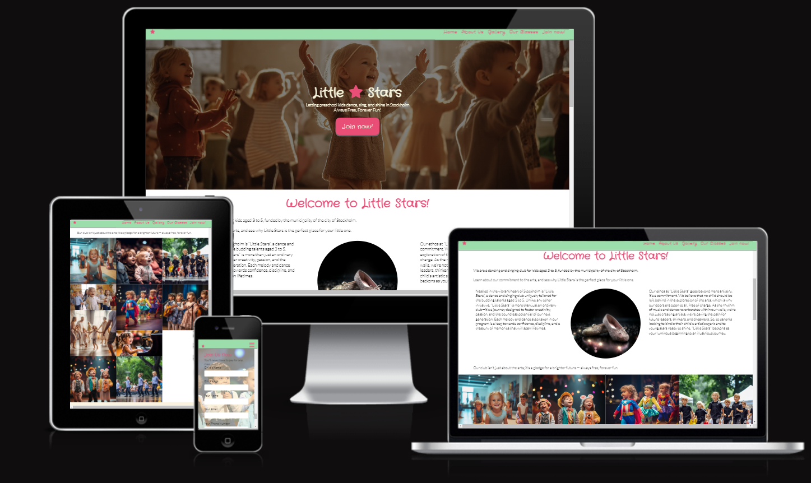

# little-star
Little Star Performance Club - Portfolio project #1

Little Stars is a site that hopes to promote the "Little Stars" performance club organized by the municipality of Stockholm. The site will be targeted toward the parents of children aged 3 to 5 year of age and living in Stockholm. Little Stars will be useful for parents to see exactly what times and days their kids would be able to participate in the club activities.
# Table of Contents
- [Little Stars Performance Club](#little-star)
- [Table of Contents](#table-of-contents)
  - [Demo](#demo)
    - [A live demo to the website can be found here](#a-live-demo-to-the-website-can-be-found-here)
  - [UX](#ux)
  - [User stories](#user-stories)
    - [Strategy](#strategy)
    - [Scope](#scope)
    - [Structure](#structure)
    - [Skeleton](#skeleton)
    - [Surface](#surface)
  - [Technologies](#technologies)
  - [Features](#features)
    - [Existing Features](#existing-features)
    - [Features Left to Implement](#features-left-to-implement)
  - [Testing](#testing)
    - [Accessibility](#accessibility)  
    - [Validator Testing](#validator-testing)
    - [Bugs](#bugs)
  - [Deployment](#deployment)
  - [Credits](#credits)
    - [Content](#content)
    - [Media](#media)

## Demo

### A live demo to the website can be found [here](https://ispeakfishlanguage.github.io/little-star/)

## UX
The main user group targeted by this website is parents of kids aged 3 to 5, as a secondary target we have the grandparents as well. The site is focused on simplicity and ease of navigation as well as showing examples of past activities, both while in class and during recitals, to give the adults a good idea of what to expect.

## User stories
As the sole developer of this website, my goal is to showcase my current skills in the web development area, as well as possibly secure employment opportunities in the coding industry.
These are the considerations I took while developing the webpage:

- Users want to understand what the webpage is about easily and as soon as they open the page.
- Users want to navigate around the website easily, be it by mouse, keyboard or touch screen.
- Users want to view information about the classes, what times they are and where the club is located.
- Users want to see what the club is all about and see if it would be something fun and positive for their own child/children.
- Users want to know what applies to their specific situation easily.

### Strategy
This website's goal is to showcase the classes and what benefits it could bring to the user and in this case, the user's child/children. The focus of the design was on showcasing all the fun the kids get, as well as be easy to navigate on any platform the user might have.

### Scope
For the users (parents and grandparents), the focus was on giving them a good overview of what the club's ethos is about, focusing on the benefits they could get as well as reminding them the classes are free. This way, the users can get a better idea of what activities to expect, how the club can help them and the children, as well as what applies to their specific situation through the contact form. The design was kept simple and linear, with only one page for ease of navigation and use.

### Structure
I followed the traditional CV framework since it is not overly complicated and it will be easy for the users to find the information they are looking for. The Online CV website has a single, long, scrolling page design. My structure features a fixed top navigation that connects the user to each of the sections from anywhere on the page. I have also included a link at the end of the navigation to download a copy of the traditional CV if the user likes that format.

**Website Sections:**
1. **_Home / Landing page:_** A concise introduction to the club.
2. **_About Us:_** Information about the ethos of the club, and the benefits of joining.
3. **_Gallery:_** Pictures of past activities with the kids, as well as an insight into the classroom setting.
4. **_Classes:_** The three classes for different age groups are divided into rows, followed by a bit of information about the classes.
5. **_Join now:_** A contact page featuring a basic contact form requesting user information, to get in contact with the club via the webpage.
6. **_Footer:_** This is not the main section of the website but rather an ending to the website with social media links and address with the contact information for the club.

### Skeleton
The website is designed to be clear and simple. And the site has a simple tree structure with hierarchical flows from top to bottom.

**Wireframe**
Balsamiq was used to craft the wireframe. While the actual site operates as a continuous scrolling page, in the wireframe, each section was conceptualized as its own distinct page, seamlessly integrated via navigation.

Wireframe design in the [(pdf format)](./Documentation/Files/Little-Stars.pdf)

### Surface
A photography was used for the hero image on the landing page. This image is very descriptive as to what the website is about, as it features toddlers dancing in a classroom environment. A plain background color was used as to not distract from the content of the webpage itself. A color palette was generated that goes well with the theme of the website: children singing and dancing. The colors are very soft and delicate.

_Hero image_

_Main color palette_

## Technologies
1. HTML - To create the basic stucture and features of the site
2. CSS - To give styling to the different features of the website and create a positive user experience
3. Balsamiq - To create a wireframe

## Features 
### Existing Features

- __Navigation Bar__

  - Featured on all sections of the webpage, the full responsive navigation bar includes links to the Logo, Home page, About Us, Gallery, Classes and Join now page and is fixed on top of the page to allow for easy navigation. When seen on mobile, the navigation bar features a dropdown menu that can be toggled by pressing on the three bars at the corner of the screen
  - This section will allow the user to easily navigate from section to section across all devices without depending on the browser features or buttons for it.

- __The landing page image__

  - The landing includes a photograph with text overlay to allow the user to see exactly what the club offers and puts a lot of emphasis on the facts that the classes are free. 
  - This section introduces the user to Little Star with an eye-catching photography and descriptional text related to the content of the website. 

- __About Us Section__

  - The about us section will allow the user to see the benefits of joining the Little Stars classes, as well as the overall benefits of learning dancing and singing for kids in preschool age. 
  - This user will see the value of signing up for the Little Stars performance club. This should encourage the user to consider signing their kids up for the classes as a way to spend their free time in a fun and constructive way. 

- __Classes section__

  - This section will allow the user to see exactly when the different age groups classes will happen, as well as how long the class will take in hours. 
  - This section will be updated as these times change to keep the user up to date. 

- __The Footer__ 

  - The footer section includes links to the relevant social media sites for Little Stars Performance Club. The links will open to a new tab to allow easy navigation for the user. The footer includes the address where the club is located, the contact number in a clickable link that will make it easier for the user to directly call from the webpage, as well as an embedded map.
  - The footer is valuable to the user as it encourages them to keep connected via social media, and helps them locate the club exactly.

- __Gallery__

  - The gallery will provide the user with supporting images to see what the club activities look like. The gallery features both picture of the classes as well as the performance events the kids can be a part of when they join. 
  - This section is of value to the user as they will be able to easily identify the types of events the club puts together. 

- __The Join Now Page__

  - This page will allow the user to get in contact with the Little Stars performance club to start their kids personal journey with the performing arts. The user will be able specify their child's as well as their own information, and some channel to reach to them with more information personalized to just their situation. The user will be asked to submit their full name, telephone number and email address, as well as their child's name and age. 

### Features Left to Implement

- The possibility for existing users to leave a comment and upload their own photos.
- A section where users can see which instructors work with what classes, and what skills they have.
- A section with information about upcoming recitals and activities.

## Testing 

* Website was tested and working in different web browsers: Chrome, Firefox, and Microsoft Edge.
* On mobile devices, I tested the my site on an iPad and an iPhone 13 with the Safari browser.
* The website is confirmed to be responsive and functions on different screen sizes using the devtools device toolbar.
* The navigation and the sections Home, About Us, Gallery, Classes, and Join now are readable and easy to understand with the help of Lighthouse.
* The form works: it requires entries in every field, only accepts an email in the email field, and the submit button works.
* The gallery section is responsive and takes up more or less space on the screen depending on the resolution.
* The text adapts in width to accommodate smaller o larger screens, always taking up the width available.
* There are no broken links on the page

### Accessibility
Icons with ARIA labels: To ensure that screen readers can understand the content.
Images with 'alt'-text: To help users with visual impairments understand what the images are about.
Contrast Requirements: The use of easy colors and easy to read and see elements.
Dyslexia/Accessible Friendly Fonts: The font used is easy to read.

### Validator Testing 

- HTML
  - No errors were returned when passing through the official [W3C validator](https://validator.w3.org/nu/?showsource=yes&doc=https%3A%2F%2Fispeakfishlanguage.github.io%2Flittle-star%2F)
- CSS
  - No errors were found when passing through the official [(Jigsaw) validator](http://jigsaw.w3.org/css-validator/validator?lang=en&profile=css3svg&uri=https%3A%2F%2Fispeakfishlanguage.github.io%2Flittle-star%2F&usermedium=all&vextwarning=&warning=1)

### Unfixed Bugs

When using the webpage on a mobile with Chrome, the menu dropdown stays open even after clicking on any of the links. This could be easily solved with JavaScript in the future. The HTML + CSS coding technologies are not enough to solve this issue at the moment.

## Deployment

- The site was deployed to GitHub pages. The steps to deploy are as follows: 
  - In the GitHub repository, navigate to the Settings tab 
  - From the source section drop-down menu, select the Master Branch
  - Once the master branch has been selected, the page will be automatically refreshed with a detailed ribbon display to indicate the successful deployment. 

The live link can be found here - [Little Stars](https://ispeakfishlanguage.github.io/little-star/)

## Credits 

### Content 

- The favicons were taken from [Icons8](https://icons8.com/)
- The text for the Home page was generated using [OpenAI's ChatGPT](https://chat.openai.com/)
- Instructions on how to implement the collapsible menu on the Navigation Bar on mobile was taken from [CI Love Running](https://github.com/Code-Institute-Solutions/love-running-v3)
- The styling for the Hero Image, as well as the buttons was from [W3 Schools](https://www.w3schools.com/howto/howto_css_hero_image.asp)
- The icons in the footer were taken from [Font Awesome](https://fontawesome.com/)
- The embedded map is from [Google maps](https://www.google.com/maps/)

### Media

- All of the images used were generated by an AI called [Midjourney](https://www.midjourney.com/home/)

